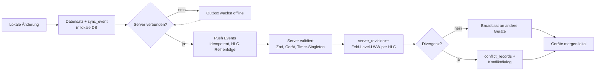
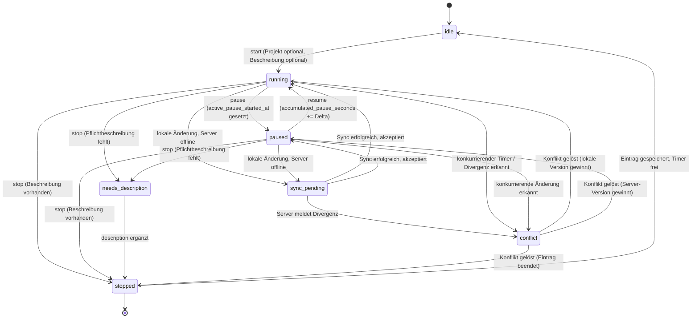

# Synchronisierung und Konfliktlösung

> Hinweis: Rechtliche Aussagen sind Produkt-Hinweise, keine Rechtsberatung. Stand der Recherche: Juli 2026.

Dieses Kapitel beschreibt das Synchronisierungskonzept von Tarlog: wie lokale Änderungen zwischen Desktop, Browser und iOS über einen optionalen, selbst gehosteten Server abgeglichen werden, wie der laufende Timer plattformübergreifend konsistent bleibt und wie Konflikte erkannt, dargestellt und ohne stillen Datenverlust aufgelöst werden. Es setzt die festgelegten Architektur-Entscheidungen um: **Event-Log + Feld-Level-LWW mit Hybrid Logical Clock (HLC)** (nicht voll-CRDT), **WebSocket primär / SSE / Polling-Fallback** und die **Single-Timer-UNIQUE-Durchsetzung** pro Main Account.

Querverweise: [Datenmodell](06-datenmodell.md) (Tabellen `devices`, `sync_states`, `sync_events`, `conflict_records`, `time_entries`, `audit_logs`), [Architektur](05-architektur.md) (Live-Kanal-Architektur, API), [Zeiterfassung](03-zeiterfassung.md) (Timer-Bedienung, Stop-Dialog), [Compliance](08-compliance.md) (Pausen-/Ruhezeitregeln), [Datenschutz und Sicherheit](09-datenschutz-sicherheit.md) (Geräte widerrufen, sichere Sessions).

## 1. Synchronisationsprinzip — Local First mit optionalem Server-Sync

Tarlog arbeitet **local-first**: Jede App (Desktop, Browser, iOS) besitzt eine vollständige lokale Datenbank und ist ohne Server voll funktionsfähig. Der Server ist ein **optionaler Synchronisationsknoten**, der als kanonische Wahrheit dient, sobald er verbunden ist. Die Synchronisierung folgt exakt den 10 Grundsätzen aus SPEC §6.1:

1. **Jede App kann lokale Änderungen erzeugen.** Alle Schreibvorgänge (Timer, Nachträge, Korrekturen, Stammdaten) laufen zuerst gegen die lokale Datenbank — offline garantiert.
2. **Jede Änderung erzeugt ein Sync Event.** Ein Mutations-Event wird transaktional zusammen mit dem Datensatz in die lokale Tabelle `sync_events` geschrieben (Outbox-Muster) — kein Event geht verloren, auch bei App-Absturz zwischen Schreib- und Sendeschritt.
3. **Sync Events werden lokal gespeichert.** Jedes Event trägt einen HLC-Zeitstempel, `device_id`, `entity_type`, `entity_id`, `operation` (`insert`/`update`/`delete`), das geänderte Feld-Set (Feld-Level-Delta) und `local_revision`.
4. **Bei Serververbindung werden Events hochgeladen.** Die Outbox wird in HLC-Reihenfolge, idempotent (Deduplizierung über `event_id` als UUIDv7), an den Server gepusht. Idempotenz erlaubt gefahrloses Retry nach Verbindungsabbruch.
5. **Der Server validiert Events.** Zod-Schemas (geteilt aus `packages/core`), Berechtigungsprüfung des Geräts (`revoked` = nein), Referenzintegrität, Uhr-Plausibilität (siehe [Uhr-Vertrauen](#7-uhr-und-vertrauenswürdigkeit)) und die Timer-Singleton-Regel.
6. **Der Server aktualisiert den kanonischen Zustand.** Bei akzeptierten Events wird `server_revision` monoton erhöht; **Feld-Level-LWW** entscheidet je Feld per HLC, welcher Wert gewinnt.
7. **Der Server sendet Änderungen an andere Geräte.** Über den Live-Kanal (WebSocket, sonst SSE, sonst Polling) werden die resultierenden Events an alle übrigen verbundenen Geräte des Main Accounts gepusht.
8. **Geräte übernehmen Änderungen in ihre lokale Datenbank.** Eingehende Events werden gegen den lokalen Stand gemergt; `server_revision` wird als Hochwassermarke gespeichert, damit der nächste Sync nur das Delta zieht.
9. **Konflikte werden erkannt.** Divergierende gleichzeitige Änderungen an demselben Feld/Datensatz werden über HLC + `server_revision`-Vergleich erkannt (siehe [Konfliktfälle](#6-konfliktfälle)).
10. **Konflikte werden lösbar dargestellt.** Nicht automatisch auflösbare Konflikte (v. a. Textdivergenz, gelöschte-vs-bearbeitete Datensätze) erzeugen einen `conflict_records`-Eintrag und einen nutzerfreundlichen Konfliktdialog — **nie stiller Datenverlust**.

### 1.1 Warum Event-Log + LWW + HLC (Entscheidung 3)

Für einen **Single-User-Multi-Device**-Fall ist voll-CRDT (z. B. Automerge) Overkill: Es gibt keine echt-nebenläufige Mehr-Autoren-Kollaboration, sondern eine Person, die selten zwei Geräte gleichzeitig aktiv bedient. Wir nutzen deshalb ein **Event-Log** (Journal aller Mutationen) plus **Feld-Level Last-Writer-Wins (LWW)**. Der Gewinner je Feld wird über eine **Hybrid Logical Clock (HLC)** bestimmt.

Eine HLC kombiniert physische Wall-Clock-Zeit mit einem logischen Zähler: `(physical_ms, logical_counter, device_id)`. Sie ist monoton, auch wenn die physische Uhr zurückspringt, und liefert eine total geordnete, geräteübergreifend vergleichbare Marke — robuster als reine Wall-Clock-Zeitstempel bei falsch gestellten Geräteuhren. Der Server bleibt die **kanonische Wahrheit** über `server_revision`; er kann eine geräteseitige HLC bei grober Uhr-Abweichung normalisieren.

**Grenze der Automatik:** Feld-Level-LWW ist für strukturierte Felder (Projekt-Zuordnung, abrechenbar-Flag, Start-/Endzeit) korrekt genug. Für **Freitext** (Tätigkeitsbeschreibung) ist stiller LWW-Verlust unerwünscht: Divergierende Beschreibungen auf zwei Geräten lösen einen **Konfliktdialog** aus, statt eine Version stumm zu überschreiben (siehe Konfliktfall 7). Voll-CRDT-Textmerge ist als spätere Option notiert, aber für V1 bewusst nicht umgesetzt.

### 1.2 Sync-Meta-Felder (überall gleich benannt)

Diese drei Felder tragen jede sync-pflichtige Tabelle (siehe [Datenmodell](06-datenmodell.md)) und werden **identisch** benannt:

| Feld | Ort | Bedeutung |
|---|---|---|
| `sync_version` | pro Datensatz | Feld-/Zeilenversion für optimistische Nebenläufigkeit; steigt bei jeder Mutation. |
| `server_revision` | serverseitig kanonisch | Monoton steigende Server-Sequenz; Hochwassermarke für Delta-Sync und Konflikterkennung. |
| `local_revision` | pro Gerät | Lokaler Änderungszähler; Grundlage für die Outbox-Reihenfolge und Rebase eingehender Events. |

### 1.3 Ablauf (Event-Log-Fluss)



## 2. Device-Modell — alle 13 Geräteinformationen (§6.2)

Jedes Gerät hat eine eigene **Device ID** (UUIDv7). Die Tabelle `devices` (siehe [Datenmodell](06-datenmodell.md)) hält pro Gerät genau diese 13 Felder:

| # | Feld | Typ (Skizze) | Bedeutung |
|---|---|---|---|
| 1 | `device_id` | UUIDv7 PK | Eindeutige Geräte-Identität, dezentral erzeugt. |
| 2 | `device_name` | TEXT | Menschlich lesbarer Gerätename ("MacBook Pro", "iPhone 15"). |
| 3 | `platform` | TEXT (`macos`/`windows`/`web`/`ios`) | Plattform des Geräts. |
| 4 | `app_version` | TEXT (SemVer) | App-Version des Clients. |
| 5 | `last_sync_at` | epoch-ms | Letzter erfolgreicher Sync (Zeitpunkt). |
| 6 | `sync_status` | TEXT (`synced`/`pending`/`offline`/`error`/`conflict`) | Aktueller Synchronisationsstatus je Gerät. |
| 7 | `local_db_version` | INTEGER | Lokale Datenbank-/Migrationsversion (Schema-Kompatibilität). |
| 8 | `server_connected` | BOOLEAN | Ob aktuell eine Serververbindung besteht. |
| 9 | `permission_status` | TEXT (`active`/`limited`/`revoked`) | Berechtigungsstatus des Geräts. |
| 10 | `revoked` | BOOLEAN | Gerät widerrufen — ja oder nein (blockiert Event-Annahme serverseitig). |
| 11 | `connected_at` | epoch-ms | Zeitpunkt der erstmaligen Verbindung/Kopplung. |
| 12 | `last_active_timer_id` | UUIDv7 (nullable) | Zuletzt aktiver Timer auf diesem Gerät (Referenz auf `timer_states`). |
| 13 | `live_channel_status` | TEXT (`websocket`/`sse`/`polling`/`none`) | Push- bzw. Live-Kanal-Status (welcher Kanal aktiv ist). |

Geräte widerrufen und Sessions/API-Tokens sperren ist in [Datenschutz und Sicherheit](09-datenschutz-sicherheit.md) beschrieben; ein widerrufenes Gerät (`revoked` = ja) darf keine Events mehr einspielen.

## 3. Timer-State-Machine (§6.3)

Der Timer-Zustand wird **serverseitig und lokal** modelliert (Tabelle `timer_states`). Pro Main Account läuft standardmäßig **nur ein aktiver Timer** gleichzeitig (Single-Timer, siehe [Enforcement](#4-single-timer-durchsetzung)). Multi-Timer für parallele Projekte ist später optional aktivierbar; **Version 1 erzwingt einen aktiven Timer**.

### 3.1 Zustände und Übergänge (alle 7 Zustände)

Ein Timer kann die 7 Zustände `idle`, `running`, `paused`, `stopped`, `needs_description`, `sync_pending`, `conflict` annehmen:



Erläuterung der 7 Zustände:

- **`idle`** — kein laufender Timer; der Account ist bereit für einen Start.
- **`running`** — Timer läuft, Zeit akkumuliert.
- **`paused`** — Timer pausiert; `active_pause_started_at` läuft, Nettozeit steht.
- **`stopped`** — Timer beendet; der Zeiteintrag ist vollständig und gespeichert.
- **`needs_description`** — gestoppt, aber projektweise verlangte Pflichtbeschreibung fehlt (Stop-Dialog erzwungen, siehe [Zeiterfassung](03-zeiterfassung.md)).
- **`sync_pending`** — lokale Änderung liegt vor, Server noch nicht bestätigt (offline oder in Übertragung).
- **`conflict`** — konkurrierende Änderung/Zweit-Timer erkannt; wartet auf Auflösung über Konfliktdialog.

### 3.2 Timer-State-Felder (alle 17 Felder)

`timer_states` enthält genau diese 17 Felder:

| # | Feld | Typ (Skizze) | Bedeutung |
|---|---|---|---|
| 1 | `timer_id` | UUIDv7 PK | Eindeutige Timer-Identität. |
| 2 | `current_time_entry_id` | UUIDv7 FK → `time_entries` | Zugehöriger, gerade erfasster Zeiteintrag. |
| 3 | `status` | TEXT-Enum | Einer der 7 Zustände (`idle`/`running`/`paused`/`stopped`/`needs_description`/`sync_pending`/`conflict`). |
| 4 | `project_id` | UUIDv7 FK (nullable) | Aktuelles Projekt (Timer ohne Projekt startbar). |
| 5 | `task_id` | UUIDv7 FK (nullable) | Aktuelle Aufgabe. |
| 6 | `started_at` | epoch-ms | Startzeitpunkt (UTC). |
| 7 | `paused_at` | epoch-ms (nullable) | Zeitpunkt der letzten Pausierung (optional). |
| 8 | `accumulated_pause_seconds` | INTEGER | Summe aller bisherigen Pausensekunden. |
| 9 | `active_pause_started_at` | epoch-ms (nullable) | Beginn der gerade laufenden Pause (optional). |
| 10 | `device_started_on` | UUIDv7 FK → `devices` | Gerät, auf dem der Timer gestartet wurde. |
| 11 | `last_modified_by_device` | UUIDv7 FK → `devices` | Gerät der letzten Änderung (für LWW/Audit). |
| 12 | `sync_version` | INTEGER | Version für optimistische Nebenläufigkeit. |
| 13 | `server_revision` | BIGINT (nullable bis Server-Sync) | Kanonische Server-Sequenz (Compare-and-Set-Anker). |
| 14 | `local_revision` | INTEGER | Lokaler Änderungszähler. |
| 15 | `description_required` | BOOLEAN | Ob beim Stoppen eine Pflichtbeschreibung nötig ist (projektabhängig). |
| 16 | `billing_status` | TEXT (`billable`/`non_billable`/`undecided`) | Abrechenbarkeits-Status des laufenden Eintrags. |
| 17 | `compliance_warnings` | JSON | Aktuelle Compliance-Hinweise (z. B. 6 Stunden ohne Pause), siehe [Compliance](08-compliance.md). |

## 4. Single-Timer-Durchsetzung (Entscheidung 4)

Pro `main_account` darf standardmäßig **nur ein aktiver Timer** (Status `running` oder `paused`) existieren. Durchgesetzt wird das mehrschichtig:

**(a) Datenbank — partieller UNIQUE-Index.** Ein partieller Unique-Index verhindert einen zweiten aktiven Timer-Row pro Main Account auf DB-Ebene (PostgreSQL serverseitig; in SQLite lokal analog):

```sql
-- Höchstens ein aktiver Timer je Main Account (running ODER paused)
CREATE UNIQUE INDEX uq_single_active_timer
  ON timer_states (main_account_id)
  WHERE status IN ('running', 'paused');
```

**(b) Server — atomares Compare-and-Set über `server_revision`.** Ein Timer-Start/Umschalten ist nur erfolgreich, wenn die vom Client mitgeschickte `server_revision` noch der kanonischen entspricht (optimistisches Locking). Skizze:

```sql
UPDATE timer_states
   SET status = 'running',
       started_at = :started_at,
       last_modified_by_device = :device_id,
       server_revision = server_revision + 1,
       sync_version = sync_version + 1
 WHERE main_account_id = :main_account_id
   AND server_revision = :expected_server_revision
   AND status IN ('idle', 'stopped');
-- 0 betroffene Zeilen => es lief bereits ein Timer => Konfliktfall 1
```

**(c) Client — offline gestarteter Zweit-Timer.** Startet ein Gerät offline einen Timer, während online bereits einer läuft, schlägt der Server-Push fehl (0 Zeilen / Unique-Verletzung). Das ist **Konfliktfall §6.5 Nr. 1**: Der zweite Timer geht in `conflict`, der Nutzer entscheidet im Konfliktdialog, welcher Timer als laufend gilt und was mit dem zweiten Zeitraum passiert (verwerfen, als Nachtrag speichern, zusammenführen).

## 5. Live-Updates (§6.4) — alle 14 Event-Typen, WS/SSE/Polling

### 5.1 Kanal-Kaskade

Für Live-Updates wird eine **Fallback-Kaskade** genutzt (siehe auch [Architektur](05-architektur.md)):

1. **WebSocket** — bevorzugte Lösung (bidirektional, geringe Latenz). In Next.js über einen Custom-Node-Server (`server.js` bei `output: 'standalone'`).
2. **Server Sent Events (SSE)** — einfachere Alternative, unidirektional Server→Client, nativ via Route Handler + `ReadableStream`; Client sendet Mutationen weiter per HTTP-POST.
3. **Polling** — Fallback für einfache Serverumgebungen ohne persistente Verbindung; periodisches Delta-Ziehen ab letzter `server_revision`.

Der aktive Kanal wird pro Gerät in `devices.live_channel_status` (`websocket`/`sse`/`polling`/`none`) protokolliert. Fällt WebSocket aus, degradiert der Client automatisch auf SSE und zuletzt auf Polling.

### 5.2 Die 14 übertragenen Live-Update-Events

Live Updates übertragen genau diese 14 Ereignistypen (§6.4):

| # | Event | Wirkung beim Empfänger |
|---|---|---|
| 1 | Timer gestartet | Timer erscheint überall als `running`. |
| 2 | Timer pausiert | Zustand `paused` überall angezeigt. |
| 3 | Timer fortgesetzt | Zustand `running` überall, Pausenzeit fixiert. |
| 4 | Timer gestoppt | Eintrag überall als `stopped`. |
| 5 | Timer Beschreibung ergänzt | Beschreibung überall aktualisiert. |
| 6 | Projekt geändert | Neues `project_id` überall. |
| 7 | Aufgabe geändert | Neues `task_id` überall. |
| 8 | Pause hinzugefügt | Neuer Pausenblock in `time_entry_breaks`. |
| 9 | Eintrag nachgetragen | Neuer manueller Zeiteintrag erscheint. |
| 10 | Eintrag geändert | Aktualisierte Felder des Zeiteintrags. |
| 11 | Rechnung erstellt | Rechnungsstatus/Anzeige aktualisiert. |
| 12 | Export erstellt | Exporthistorie aktualisiert. |
| 13 | Konflikt erkannt | Konfliktbanner/-dialog wird ausgelöst. |
| 14 | Sync abgeschlossen | Sync-Status je Gerät auf `synced` gesetzt. |

Ziel-Szenario (SPEC §6): Startet der Nutzer im Browser auf dem Handy den Timer, zeigt die macOS-/Windows-Desktop-App ihn ebenfalls als laufend an; pausiert er auf dem Desktop, zeigt der Browser den pausierten Zustand; stoppt er auf iOS, erscheint der Eintrag überall als gestoppt.

## 6. Konfliktfälle (§6.5) — alle 10 nummeriert

Jeder Konfliktfall ist mit **Auslöser, Erkennung, Auflösungsstrategie, Gewinner und Audit-Eintrag** dokumentiert. Erkennung basiert auf HLC-Vergleich, `server_revision`/`sync_version`-Divergenz und der Timer-Singleton-Regel. Jeder Konflikt erzeugt einen `conflict_records`-Eintrag und einen `audit_logs`-Eintrag mit `before_json`/`after_json`/`reason`.

### Konfliktfall 1 — Desktop startet Timer offline, während Browser online bereits einen Timer gestartet hat
- **Auslöser:** Zweiter Timer-Start bei bereits laufendem aktivem Timer.
- **Erkennung:** Partieller UNIQUE-Index + Compare-and-Set (0 Zeilen) beim Server-Push (siehe [Single-Timer](#4-single-timer-durchsetzung)).
- **Auflösungsstrategie:** Konfliktdialog bietet: bestehenden Timer laufen lassen und Offline-Zeitraum als Nachtrag speichern, oder Offline-Timer übernehmen und laufenden stoppen. Nie stiller Verlust der offline erfassten Zeit.
- **Gewinner:** Nutzerentscheidung; Default-Vorschlag: früher gestarteter (per HLC) Timer bleibt aktiv, der andere Zeitraum wird zum Nachtrag.
- **Audit:** `audit_logs` "Sync Konflikt gelöst" + Verweis auf beide `timer_id`; `conflict_records` mit Grund `single_timer_violation`.

### Konfliktfall 2 — iOS stoppt Timer, während Desktop offline weiterlaufen lässt
- **Auslöser:** Stop auf Gerät A, während Gerät B denselben Timer offline weiterführt.
- **Erkennung:** Beim Reconnect trägt der Desktop einen jüngeren `active`-Zustand, der Server hat aber bereits `stopped` (höhere `server_revision`).
- **Auflösungsstrategie:** Dialog zeigt Server-Stopp vs. lokal-weitergelaufene Zeit; Nutzer wählt tatsächliches Ende oder legt aus der Restzeit einen zweiten Eintrag an.
- **Gewinner:** Server-`stopped` gilt als kanonisch; überschüssige lokale Zeit wird nicht verworfen, sondern als Vorschlag angeboten.
- **Audit:** "Timer gestoppt" (Server) + "Endzeit korrigiert" (Auflösung) mit `reason`.

### Konfliktfall 3 — Projekt wurde auf Gerät A gelöscht, während Gerät B dafür Zeit erfasst
- **Auslöser:** Delete des Projekts vs. neuer/laufender Zeiteintrag auf dieses Projekt.
- **Erkennung:** FK-Referenz eines Events zeigt auf ein soft-gelöschtes `projects.deleted_at`.
- **Auflösungsstrategie:** Soft-Delete verhindert Datenverlust; Dialog schlägt vor, Projekt wiederherzustellen oder den Eintrag umzuhängen/als "verwaist" zu markieren.
- **Gewinner:** Datensatz-erhaltend — der Zeiteintrag bleibt bestehen; Projektlöschung wird zurückgestellt, bis der Eintrag umgehängt ist.
- **Audit:** "Eintrag geändert"/"Projekt geändert" mit `reason = project_deleted_conflict`.

### Konfliktfall 4 — Stundensatz wurde geändert, während Gerät B offline einen Eintrag erstellt
- **Auslöser:** Rate-Änderung auf Gerät A vs. neuer Offline-Eintrag auf Gerät B mit altem Satz.
- **Erkennung:** `rate_snapshot` des Eintrags weicht vom aktuellen `billing_rates`-Satz zum Leistungsdatum ab.
- **Auflösungsstrategie:** Snapshot-Prinzip: Der beim Eintrag gespeicherte `rate_snapshot` bleibt gültig (historisierte Sätze, siehe [Abrechnung](10-abrechnung-export.md)); Neuberechnung nur auf ausdrückliche Nutzeraktion mit Begründung.
- **Gewinner:** Kein Konflikt im engeren Sinn — der zeitpunktbezogene Snapshot gewinnt; keine rückwirkende stille Neubewertung.
- **Audit:** "Stundensatz geändert" separat; Eintrag behält Snapshot.

### Konfliktfall 5 — Rundungsregel wurde geändert, während Gerät B offline Arbeitszeit nachträgt
- **Auslöser:** Änderung der `rounding_rules` vs. Offline-Nachtrag mit alter Regel.
- **Erkennung:** `rounding_rule_id`/`calculation_version` des Eintrags weicht von der aktuellen Projekt-/Kundenregel ab.
- **Auflösungsstrategie:** Wie bei Nr. 4 — die zum Eintrag gehörende Regel-/Berechnungsversion bleibt maßgeblich; optionale Neuberechnung nur bewusst und protokolliert.
- **Gewinner:** Gespeicherte `rounding_rule_id` + `calculation_version` des Eintrags (siehe [Zeitberechnung](07-zeitberechnung-rundung.md)).
- **Audit:** "Rundungsregel geändert" separat; Eintrag bleibt stabil.

### Konfliktfall 6 — gleicher Zeiteintrag wurde auf zwei Geräten bearbeitet
- **Auslöser:** Parallele Updates desselben `time_entries.id` auf Gerät A und B.
- **Erkennung:** Feld-Level-LWW erkennt konkurrierende Feld-Deltas mit gleicher/überlappender HLC-Region; `sync_version`-Divergenz.
- **Auflösungsstrategie:** Nicht überlappende Felder werden automatisch gemergt (Feld-Level-LWW per HLC); überlappende, semantisch heikle Felder (Start-/Endzeit, abrechenbar) lösen bei Widerspruch einen Diff-Dialog aus.
- **Gewinner:** Je Feld die jüngere HLC; bei kritischer Kollision Nutzerentscheidung. Nie stiller Gesamtverlust.
- **Audit:** "Eintrag geändert" + `conflict_records` mit Feldliste, `before_json`/`after_json`.

### Konfliktfall 7 — Beschreibung wurde auf zwei Geräten unterschiedlich geändert
- **Auslöser:** Divergierende Freitext-Beschreibung auf zwei Geräten.
- **Erkennung:** Beide Werte weichen von der gemeinsamen Basis ab (Textfeld-Divergenz), HLC nahe beieinander.
- **Auflösungsstrategie:** **Kein stiller LWW für Freitext** (Entscheidung 3) — Konfliktdialog zeigt lokale Version, Server-Version und einen kombinierten Vorschlag; Nutzer wählt oder editiert.
- **Gewinner:** Ausschließlich Nutzerentscheidung.
- **Audit:** "Beschreibung geändert" + `conflict_records` mit beiden Textständen.

### Konfliktfall 8 — Rechnung wurde erstellt, während weitere Zeiten offline hinzukommen
- **Auslöser:** Finalisierte/erstellte Rechnung vs. später eintreffende Offline-Zeiteinträge desselben Zeitraums.
- **Erkennung:** Neue Einträge fallen in den Leistungszeitraum einer bereits finalisierten (gesperrten) Rechnung.
- **Auflösungsstrategie:** Finalisierte Rechnungen sind **immutable** (siehe [Abrechnung](10-abrechnung-export.md)); nachträgliche Zeiten landen in "nicht abgerechnet" und werden für eine Folge-/Nachrechnung vorgeschlagen — nie stille Änderung der gesperrten Rechnung.
- **Gewinner:** Die finalisierte Rechnung bleibt unverändert; neue Zeiten werden separat geführt.
- **Audit:** "Rechnung erstellt"/"Rechnung finalisiert" bleibt bestehen; neuer Eintrag mit Flag "nach Rechnung eingegangen".

### Konfliktfall 9 — Eintrag wurde gelöscht, während ein anderes Gerät ihn bearbeitet
- **Auslöser:** Delete auf Gerät A vs. Update desselben Eintrags auf Gerät B.
- **Erkennung:** Update-Event trifft auf einen soft-gelöschten Datensatz (`deleted_at` gesetzt).
- **Auflösungsstrategie:** Delete-vs-Edit ist nicht auto-auflösbar → Dialog: Löschung bestätigen (Edit verwerfen) oder Eintrag wiederherstellen und Edit anwenden. Soft-Delete garantiert Wiederherstellbarkeit.
- **Gewinner:** Nutzerentscheidung; Default-Vorschlag: Wiederherstellen + Edit anwenden (datenerhaltend).
- **Audit:** "Eintrag gelöscht" + "Eintrag geändert" + `conflict_records` mit Grund `delete_vs_edit`.

### Konfliktfall 10 — lokale Uhrzeit eines Geräts ist falsch
- **Auslöser:** Grob abweichende Geräteuhr erzeugt implausible `started_at`/`ended_at`/HLC.
- **Erkennung:** Server vergleicht Gerätezeit mit Serverzeit (siehe [Uhr-Vertrauen](#7-uhr-und-vertrauenswürdigkeit)); Abweichung über Schwelle.
- **Auflösungsstrategie:** Eintrag als **verdächtig markieren**, Server-Empfangszeit als Referenz speichern, HLC serverseitig normalisieren; Nutzer kann mit Begründung manuell korrigieren.
- **Gewinner:** Serverzeit als Vertrauensanker für die Ordnung; die erfassten Dauern bleiben erhalten, nur die absolute Lage wird plausibilisiert/markiert.
- **Audit:** "Startzeit korrigiert"/"Endzeit korrigiert" mit `reason = clock_skew`; `source`-Feld dokumentiert Zeitquelle.

### 6.1 Konfliktlösungs-Grundsätze — alle 10 (§6.5)

Für die Darstellung und Auflösung gelten übergreifend diese 10 Grundsätze:

1. **Nutzerfreundlicher Konfliktdialog** — verständlich, ohne technischen Jargon.
2. **Unterschiede anzeigen** — feldweiser Diff der divergierenden Werte.
3. **Lokale Version anzeigen** — der Stand des aktuellen Geräts.
4. **Server Version anzeigen** — der kanonische Stand.
5. **Kombinierte Version vorschlagen** — ein Merge-Vorschlag, wo sinnvoll.
6. **Manuell entscheiden** — der Nutzer hat immer das letzte Wort.
7. **Nie still Daten verlieren** — keine automatische Überschreibung ohne Wiederherstellbarkeit; Soft-Delete + Event-Log erhalten jeden Stand.
8. **Audit Log erzeugen** — jede Auflösung wird in `audit_logs` protokolliert (`before_json`/`after_json`).
9. **Konfliktgrund dokumentieren** — `conflict_records` hält Auslöser/Grund fest.
10. **Serverseitige Revision erhöhen** — nach Auflösung steigt `server_revision`, damit alle Geräte den finalen Stand ziehen.

## 7. Uhr und Vertrauenswürdigkeit (§6.6) — alle 8 Funktionen

Da Zeiterfassung stark von korrekten Uhrzeiten abhängt, muss das System mit Geräteuhr-Problemen umgehen. Diese 8 Funktionen sind umgesetzt:

1. **Serverzeit und Gerätezeit vergleichen** — bei jedem Sync wird die Differenz (`clock_offset_ms`) zwischen Geräteuhr und Serveruhr bestimmt.
2. **Warnung bei großer Abweichung** — überschreitet die Differenz eine konfigurierbare Schwelle, warnt die App und markiert betroffene Einträge (siehe Konfliktfall 10).
3. **Startzeit lokal speichern** — die vom Gerät erfasste `started_at` wird immer festgehalten (Nutzerbeleg).
4. **Server Empfangszeit speichern** — der Server hält den Zeitpunkt fest, zu dem er das Event empfangen hat (`server_received_at`).
5. **Sync Empfangszeit speichern** — der Zeitpunkt, zu dem ein anderes Gerät die Änderung übernommen hat (`sync_received_at`).
6. **Zeitquelle dokumentieren** — je Eintrag wird die `source` der Zeit (Geräteuhr, Serverkorrektur, manuelle Eingabe) protokolliert.
7. **Verdächtige Einträge markieren** — Einträge mit implausibler Uhr erhalten ein Flag und erscheinen in Compliance-/Report-Ansichten.
8. **Manuelle Korrektur mit Begründung erlauben** — der Nutzer kann Zeiten korrigieren; die Begründung landet im [Audit-Log](06-datenmodell.md) ("Startzeit korrigiert"/"Endzeit korrigiert" mit `reason`).

Die HLC nutzt diese Signale, um trotz falscher Wall-Clock eine stabile, geräteübergreifende Ordnung zu garantieren; der Server bleibt Vertrauensanker für die absolute Zeitlage.
