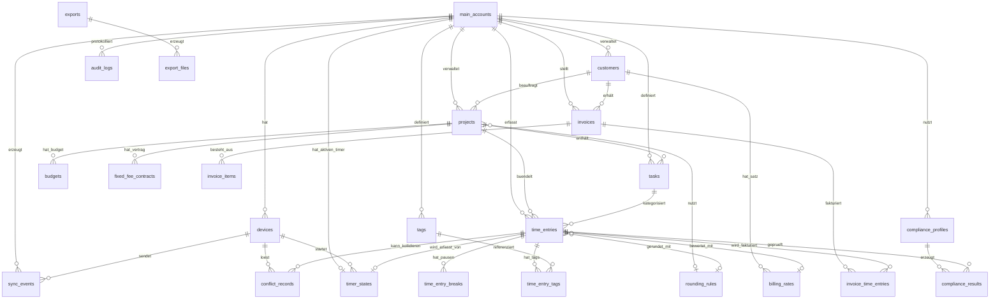

# Datenmodell

> Hinweis: Rechtliche Aussagen sind Produkt-Hinweise, keine Rechtsberatung. Stand der Recherche: Juli 2026.

Dieses Dokument definiert das vollständige Datenmodell für Tarlog, alle **31 SPEC-Tabellen + 1 abgeleitete Tabelle `timer_states` (aus SPEC §6.3)** für Version 1 und alle **8 vorbereiteten Team-Tabellen** aus SPEC §24. Es setzt die im [Architekturdokument](05-architektur.md) festgelegten Konventionen um und ist Grundlage für die [Zeitberechnungs- und Rundungslogik](07-zeitberechnung-rundung.md), das [Compliance-Modul](08-compliance.md), das [Sync-Konzept](04-sync.md) sowie [Abrechnung und Export](10-abrechnung-export.md).

## 0. Grundkonventionen (aus PLAN §1, hier nur angewendet, nicht neu verhandelt)

| Konvention | Festlegung | Begründung |
|---|---|---|
| **Primärschlüssel** | `id` als **UUIDv7** (`TEXT` in SQLite, `UUID` in Postgres) auf jeder Tabelle | zeitgeordnet, dezentral/offline erzeugbar, gute B-Tree-Lokalität für verteilte Writes/Merges |
| **Tokens/Secrets** | **UUIDv4** bzw. kryptografischer Zufall (nur `api_tokens`, `sessions`) | keine Zeitordnung erwünscht, unratbar |
| **Geld** | `amount_cents BIGINT` (Integer minor units) + `currency CHAR(3)` (ISO 4217) | nie Float, exakte kaufmännische Rechnung |
| **Zeitpunkte** | `*_at` als UTC, `INTEGER` epoch-ms (SQLite) / `TIMESTAMPTZ` (Postgres) | eindeutig, DST-sicher; Anzeige-Zeitzone separat |
| **Zeitzone** | `timezone TEXT` (IANA, z. B. `Europe/Berlin`) pro Zeiteintrag | über-Mitternacht/DST korrekt auflösbar |
| **Dauern** | `*_seconds INTEGER` | sekundengenaue tatsächliche Zeit; Anzeige gerundet auf Minuten |
| **ORM** | **Drizzle ORM**, ein Schema, Dialekt-Switch SQLite↔PostgreSQL | siehe [Architektur](05-architektur.md) Entscheidung |
| **Validierung** | **Zod** im `packages/core`, geteilt über alle Apps | eine Wahrheit für Feld-Constraints |

### Standard-Spalten pro Tabelle

Jede fachliche Tabelle trägt einen einheitlichen Spalten-Sockel. In den Feldtabellen unten wird er nur dort wiederholt, wo er abweicht; ansonsten gilt:

| Spalte | Typ | Bedeutung |
|---|---|---|
| `id` | UUIDv7 PK | Primärschlüssel |
| `main_account_id` | UUIDv7 FK → `main_accounts.id` | Mandantenschlüssel (Single-User-Isolation, Team-Vorbereitung) |
| `created_at` | timestamp (UTC) | Erstellzeitpunkt |
| `updated_at` | timestamp (UTC) | letzte Änderung |
| `deleted_at` | timestamp (UTC), NULL | Soft-Delete-Marker (nur wo Soft-Delete = ja) |

### Sync-Meta-Spalten (nur wo **Sync-Pflicht = ja**)

Exakt gleich benannt wie im [Sync-Konzept](04-sync.md) und im README-Feldnamen-Glossar, Divergenz wäre ein Datenmodell-Fehler:

| Spalte | Typ | Bedeutung |
|---|---|---|
| `sync_version` | INTEGER | monoton steigende lokale Änderungszählung der Row |
| `server_revision` | INTEGER, NULL | kanonische Revision, die der Server vergeben hat (Quelle der Wahrheit) |
| `local_revision` | INTEGER | lokale Revision seit letztem bestätigten Server-Stand |
| `hlc` | TEXT | Hybrid Logical Clock des letzten Writes (Feld-Level-LWW-Tiebreak) |
| `last_modified_by_device` | UUIDv7 FK → `devices.id` | welches Gerät zuletzt schrieb |

### Konfliktstrategie-Legende (Meta-Zeile jeder Tabelle)

Gemäß Entscheidung **Event-Log + Feld-Level-LWW mit Hybrid Logical Clock (HLC)**, Server = kanonische Wahrheit via `server_revision`. Verwendete Strategien:

| Kürzel | Strategie | Einsatz |
|---|---|---|
| **LWW-field** | Feld-Level Last-Writer-Wins per HLC | Standard für unabhängig editierbare Felder |
| **LWW-field + Text-Merge-Dialog** | wie LWW, aber divergente Freitextfelder (Beschreibung) lösen einen Konfliktdialog aus statt stillem Überschreiben | `time_entries.description`, Notizfelder |
| **server-authoritative** | Server-Zustand gewinnt hart (atomares Compare-and-Set über `server_revision`) | Timer-Singleton, Rechnungsnummernkreis, finalisierte Rechnungen |
| **immutable-after-finalize** | nach Finalisierung/Sperre keine Änderung mehr; nur Storno/Neuversion | `invoices` (finalisiert), `audit_logs`, `exports` |
| **append-only** | nur Einfügen, nie Update/Delete; keine Konflikte möglich | `audit_logs`, `sync_events` |
| **local-only** | wird nicht synchronisiert; kein Konflikt | `local_profiles`, `backups`, gerätelokale `settings` |
| **create-wins / delete-wins** | Sonderregel bei Löschung vs. Bearbeitung (siehe [Konfliktfälle](04-sync.md#konfliktfälle)) | referenzielle Konflikte (Projekt gelöscht, während erfasst) |

---

# TEIL A, 31 SPEC-Tabellen für Version 1 (+ abgeleitete Tabelle `timer_states`)

## A.1 Identität, Geräte und Synchronisierung

### `main_accounts`

Das Hauptkonto, im lokalen Modus genau ein Profil, im Server-Modus der Mandantenanker. Wurzel jeder referenziellen Kette.

| Feld | Typ | PK/FK | Constraint / Index |
|---|---|---|---|
| `id` | UUIDv7 | PK |, |
| `display_name` | TEXT |, | NOT NULL |
| `mode` | ENUM(`local`,`server`,`hybrid`) |, | NOT NULL, default `local` |
| `email` | TEXT |, | NULL (nur Server-Modus), UNIQUE WHERE NOT NULL |
| `company_name` | TEXT |, | NULL |
| `default_currency` | CHAR(3) |, | NOT NULL, default `EUR` |
| `default_locale` | TEXT |, | NOT NULL, default `de-DE` |
| `default_timezone` | TEXT |, | NOT NULL, IANA, default `Europe/Berlin` |
| `default_compliance_profile_id` | UUIDv7 | FK → `compliance_profiles.id` | NULL |
| `password_hash` | TEXT |, | NULL (Argon2id, nur Server/App-Lock) |
| `created_at`/`updated_at`/`deleted_at` | timestamp |, | Standard-Sockel |

**Meta:** Soft-Delete: **nein** (Wurzelentität) · Audit-Pflicht: **ja** · Sync-Pflicht: **ja** · Konfliktstrategie: **server-authoritative**.

### `local_profiles`

Gerätelokales Hauptprofil für den reinen Desktop-Modus (SPEC §3): App-Passwort-Schutz, Face ID / Touch ID optional, verschlüsselte lokale DB optional. Verlässt das Gerät nie.

| Feld | Typ | PK/FK | Constraint / Index |
|---|---|---|---|
| `id` | UUIDv7 | PK |, |
| `main_account_id` | UUIDv7 | FK → `main_accounts.id` | NOT NULL |
| `device_id` | UUIDv7 | FK → `devices.id` | NOT NULL |
| `app_lock_enabled` | BOOLEAN |, | default false |
| `app_lock_method` | ENUM(`none`,`password`,`biometric`) |, | default `none` |
| `biometric_kind` | ENUM(`none`,`touch_id`,`face_id`) |, | default `none` |
| `db_encryption_enabled` | BOOLEAN |, | default false (SQLCipher) |
| `telemetry_opt_in` | BOOLEAN |, | default false (keine Telemetrie im Standard) |
| `created_at`/`updated_at` | timestamp |, | Standard-Sockel |

**Meta:** Soft-Delete: **nein** · Audit-Pflicht: **nein** · Sync-Pflicht: **nein** (local-only) · Konfliktstrategie: **local-only**.

### `devices`

Ein Gerät = eine Device ID. Deckt SPEC §6.2 (alle 13 Geräteinfo-Felder), siehe auch [Sync](04-sync.md#geräte).

| Feld | Typ | PK/FK | Constraint / Index |
|---|---|---|---|
| `id` (**Device ID**) | UUIDv7 | PK |, |
| `main_account_id` | UUIDv7 | FK → `main_accounts.id` | NOT NULL, INDEX |
| `device_name` (**Gerätename**) | TEXT |, | NOT NULL |
| `platform` (**Plattform**) | ENUM(`macos`,`windows`,`web`,`ios`) |, | NOT NULL |
| `app_version` (**App Version**) | TEXT |, | NOT NULL |
| `last_sync_at` (**letzter Sync**) | timestamp |, | NULL, INDEX |
| `sync_status` (**Sync Status**) | ENUM(`synced`,`pending`,`offline`,`error`,`conflict`) |, | default `offline` |
| `local_db_version` (**lokale Datenbank Version**) | INTEGER |, | NOT NULL |
| `server_connected` (**Server Verbindung**) | BOOLEAN |, | default false |
| `permission_status` (**Berechtigungsstatus**) | ENUM(`active`,`limited`,`revoked`) |, | default `active` |
| `revoked` (**Widerrufen ja/nein**) | BOOLEAN |, | default false |
| `connected_at` (**verbunden am**) | timestamp |, | NOT NULL |
| `last_active_timer_id` (**letzter aktiver Timer**) | UUIDv7 | FK → `timer_states.timer_id` | NULL |
| `live_channel_status` (**Push/Live-Kanal Status**) | ENUM(`websocket`,`sse`,`polling`,`none`) |, | default `none` |
| `created_at`/`updated_at`/`deleted_at` | timestamp |, | Standard-Sockel |

**Meta:** Soft-Delete: **ja** · Audit-Pflicht: **ja** (Gerät verbunden/getrennt) · Sync-Pflicht: **ja** · Konfliktstrategie: **server-authoritative** (Widerruf/Berechtigung serverseitig).

### `sync_states`

Pro Gerät der Fortschritt der Synchronisierung (Cursor/Wasserzeichen), welcher Event-Stand hoch- bzw. heruntergeladen ist.

| Feld | Typ | PK/FK | Constraint / Index |
|---|---|---|---|
| `id` | UUIDv7 | PK |, |
| `main_account_id` | UUIDv7 | FK → `main_accounts.id` | NOT NULL |
| `device_id` | UUIDv7 | FK → `devices.id` | NOT NULL, UNIQUE(`device_id`) |
| `last_pushed_server_revision` | INTEGER |, | default 0 |
| `last_pulled_server_revision` | INTEGER |, | default 0, INDEX |
| `last_hlc` | TEXT |, | Hybrid Logical Clock |
| `pending_event_count` | INTEGER |, | default 0 |
| `last_error` | TEXT |, | NULL |
| `updated_at` | timestamp |, | Standard-Sockel |

**Meta:** Soft-Delete: **nein** · Audit-Pflicht: **nein** · Sync-Pflicht: **nein** (beschreibt Sync selbst, wird nicht mit-synchronisiert) · Konfliktstrategie: **server-authoritative**.

### `sync_events`

Das Event-Log, Herz der local-first-Synchronisierung (SPEC §6.1). Jede Änderung erzeugt ein Event; append-only, unveränderlich.

| Feld | Typ | PK/FK | Constraint / Index |
|---|---|---|---|
| `id` | UUIDv7 | PK |, |
| `main_account_id` | UUIDv7 | FK → `main_accounts.id` | NOT NULL, INDEX |
| `device_id` | UUIDv7 | FK → `devices.id` | NOT NULL |
| `entity_type` | TEXT |, | NOT NULL |
| `entity_id` | UUIDv7 |, | NOT NULL, INDEX(`entity_type`,`entity_id`) |
| `operation` | ENUM(`create`,`update`,`delete`) |, | NOT NULL |
| `payload_json` | JSON |, | NOT NULL (geänderte Felder + Werte) |
| `hlc` | TEXT |, | NOT NULL, INDEX (Ordnung) |
| `local_revision` | INTEGER |, | NOT NULL |
| `server_revision` | INTEGER |, | NULL bis vom Server bestätigt, INDEX |
| `correlation_id` | UUIDv7 |, | NULL (Verknüpfung zu Audit/Konflikt) |
| `applied` | BOOLEAN |, | default false |
| `created_at` | timestamp |, | NOT NULL, INDEX |

**Meta:** Soft-Delete: **nein** · Audit-Pflicht: **nein** (ist selbst das Protokoll) · Sync-Pflicht: **ja** (Kern) · Konfliktstrategie: **append-only** (Events werden nie überschrieben; Konflikte entstehen erst beim Anwenden auf Ziel-Rows).

### `timer_states` (abgeleitet aus SPEC §6.3)

Persistierter Timer-Zustand pro laufendem/pausierendem Timer, nicht eine der 31 SPEC-Tabellen, sondern die aus SPEC §6.3 abgeleitete Materialisierung der Timer-State-Machine. Vollständig definiert in [Sync](04-sync.md#3-timer-state-machine); hier als Tabelle im gleichen Format geführt, weil die State-Machine, der partielle UNIQUE-Index und `UPDATE timer_states` (Compare-and-Set) darauf verweisen.

| Feld | Typ | PK/FK | Constraint / Index |
|---|---|---|---|
| `timer_id` | UUIDv7 | PK |, |
| `main_account_id` | UUIDv7 | FK → `main_accounts.id` | NOT NULL, **UNIQUE(`main_account_id`) WHERE `status` IN (`running`,`paused`)** (partieller Index) |
| `current_time_entry_id` | UUIDv7 | FK → `time_entries.id` | NULL |
| `status` | ENUM(`idle`,`running`,`paused`,`stopped`,`needs_description`,`sync_pending`,`conflict`) |, | NOT NULL, default `idle` |
| `project_id` | UUIDv7 | FK → `projects.id` | NULL |
| `task_id` | UUIDv7 | FK → `tasks.id` | NULL |
| `started_at` | INTEGER (epoch-ms UTC) |, | NULL (gesetzt ab `running`) |
| `paused_at` | INTEGER (epoch-ms UTC) |, | NULL |
| `accumulated_pause_seconds` | INTEGER |, | NOT NULL, default 0 |
| `active_pause_started_at` | INTEGER (epoch-ms UTC) |, | NULL |
| `device_started_on` | UUIDv7 | FK → `devices.id` | NOT NULL |
| `last_modified_by_device` | UUIDv7 | FK → `devices.id` | NOT NULL |
| `sync_version` | INTEGER |, | NOT NULL, default 0 |
| `server_revision` | BIGINT |, | NULL bis Server-Sync (Compare-and-Set-Anker) |
| `local_revision` | INTEGER |, | NOT NULL, default 0 |
| `description_required` | BOOLEAN |, | default false |
| `billing_status` | ENUM(`billable`,`non_billable`,`undecided`) |, | default `undecided` |
| `compliance_warnings` | JSON |, | NULL |

**Meta:** Soft-Delete: **nein** · Audit-Pflicht: **ja** · Sync-Pflicht: **ja** · Konfliktstrategie: **serverseitiges Compare-and-Set via `server_revision`** (optimistisches Locking, siehe [Sync §4b](04-sync.md#4-single-timer-durchsetzung)); Konfliktfall → `conflict_records`.

## A.2 Stammdaten, Kunden, Projekte, Aufgaben, Tags

### `customers`

Kundenstammdaten (SPEC §9, alle 25 Felder, Detail-Semantik in [Abrechnung/Export](10-abrechnung-export.md#kundenverwaltung)).

| Feld | Typ | PK/FK | Constraint / Index |
|---|---|---|---|
| `id` | UUIDv7 | PK |, |
| `main_account_id` | UUIDv7 | FK → `main_accounts.id` | NOT NULL, INDEX |
| `name` | TEXT |, | NOT NULL |
| `company` | TEXT |, | NULL |
| `contact_person` | TEXT |, | NULL |
| `email` | TEXT |, | NULL |
| `phone` | TEXT |, | NULL |
| `billing_address` | TEXT |, | NULL |
| `shipping_address` | TEXT |, | NULL |
| `vat_id` | TEXT |, | NULL (USt-IdNr) |
| `customer_number` | TEXT |, | UNIQUE(`main_account_id`,`customer_number`) |
| `payment_term_days` | INTEGER |, | default 14 |
| `default_currency` | CHAR(3) |, | default aus `main_accounts` |
| `default_hourly_rate_cents` | BIGINT |, | NULL |
| `default_day_rate_cents` | BIGINT |, | NULL |
| `default_rounding_rule_id` | UUIDv7 | FK → `rounding_rules.id` | NULL |
| `default_invoice_note` | TEXT |, | NULL |
| `default_language` | TEXT |, | default `de-DE` |
| `pdf_template_id` | UUIDv7 |, | NULL (kundenspez. PDF-Vorlage) |
| `invoice_template_id` | UUIDv7 |, | NULL |
| `internal_notes` | TEXT |, | NULL |
| `external_notes` | TEXT |, | NULL |
| `status` | ENUM(`active`,`paused`,`archived`) |, | default `active`, INDEX |
| `default_tax_rate` | NUMERIC(5,2) |, | default 19.00 |
| `reverse_charge_hint` | BOOLEAN |, | default false |
| `small_business_hint` | BOOLEAN |, | default false (Kleinunternehmer §19 UStG) |
| `preferred_export_detail` | ENUM(`summary`,`detailed`,`full`) |, | default `detailed` |
| `created_at`/`updated_at`/`deleted_at` | timestamp |, | Standard-Sockel |

**Meta:** Soft-Delete: **ja** · Audit-Pflicht: **ja** (Stundensatz/Steuer-Änderungen) · Sync-Pflicht: **ja** · Konfliktstrategie: **LWW-field**.

### `projects`

Projektstammdaten (SPEC §10, alle 33 Felder, Semantik in [Abrechnung/Export](10-abrechnung-export.md#projektverwaltung)).

| Feld | Typ | PK/FK | Constraint / Index |
|---|---|---|---|
| `id` | UUIDv7 | PK |, |
| `main_account_id` | UUIDv7 | FK → `main_accounts.id` | NOT NULL, INDEX |
| `name` | TEXT |, | NOT NULL |
| `customer_id` | UUIDv7 | FK → `customers.id` | NULL, INDEX |
| `description` | TEXT |, | NULL |
| `status` | ENUM(`planned`,`active`,`paused`,`completed`,`archived`) |, | default `active`, INDEX |
| `project_code` | TEXT |, | UNIQUE(`main_account_id`,`project_code`) |
| `color` | TEXT |, | NULL (Hex) |
| `start_date` | DATE |, | NULL |
| `end_date` | DATE |, | NULL |
| `billing_type` | ENUM(`hourly`,`day_rate`,`fixed_fee`,`retainer`,`non_billable`) |, | NOT NULL |
| `hourly_rate_cents` | BIGINT |, | NULL |
| `day_rate_cents` | BIGINT |, | NULL |
| `fixed_fee_cents` | BIGINT |, | NULL |
| `retainer_id` | UUIDv7 | FK → `fixed_fee_contracts.id` | NULL |
| `budget_hours` | NUMERIC(10,2) |, | NULL |
| `budget_money_cents` | BIGINT |, | NULL |
| `budget_warn_thresholds` | JSON |, | NULL (z. B. `[0.8,1.0]`) |
| `planned_hours` | NUMERIC(10,2) |, | NULL |
| `actual_hours` | NUMERIC(10,2) |, | berechnet/gecacht |
| `billable_hours` | NUMERIC(10,2) |, | berechnet/gecacht |
| `non_billable_hours` | NUMERIC(10,2) |, | berechnet/gecacht |
| `rounding_rule_id` | UUIDv7 | FK → `rounding_rules.id` | NULL |
| `default_task_id` | UUIDv7 | FK → `tasks.id` | NULL |
| `allowed_task_ids` | JSON |, | NULL (Liste erlaubter Aufgaben) |
| `mandatory_tags` | JSON |, | NULL |
| `description_required` | BOOLEAN |, | default false |
| `backdating_allowed` | BOOLEAN |, | default true (Nachtrag erlaubt) |
| `backdating_reason_required` | BOOLEAN |, | default false |
| `max_retroactive_edit_days` | INTEGER |, | NULL |
| `internal_notes` | TEXT |, | NULL |
| `external_description` | TEXT |, | NULL (für Kundenreports) |
| `invoice_template_id` | UUIDv7 |, | NULL |
| `export_template_id` | UUIDv7 |, | NULL |
| `archived_at` | timestamp |, | NULL (Projektarchiv) |
| `created_at`/`updated_at`/`deleted_at` | timestamp |, | Standard-Sockel |

**Meta:** Soft-Delete: **ja** · Audit-Pflicht: **ja** (Satz-/Rundungsregel-Änderung) · Sync-Pflicht: **ja** · Konfliktstrategie: **LWW-field**; Löschung vs. laufende Erfassung → **delete-wins mit Tombstone-Warnung** ([Konfliktfall 3](04-sync.md#konfliktfälle)).

### `tasks`

Aufgaben/Tätigkeitsarten, global oder projektbezogen (SPEC §11, 10 Felder).

| Feld | Typ | PK/FK | Constraint / Index |
|---|---|---|---|
| `id` | UUIDv7 | PK |, |
| `main_account_id` | UUIDv7 | FK → `main_accounts.id` | NOT NULL, INDEX |
| `project_id` | UUIDv7 | FK → `projects.id` | NULL (NULL = global) |
| `name` | TEXT |, | NOT NULL |
| `description` | TEXT |, | NULL |
| `default_billable` | BOOLEAN |, | default true |
| `default_hourly_rate_cents` | BIGINT |, | NULL |
| `default_day_rate_cents` | BIGINT |, | NULL |
| `default_description_template` | TEXT |, | NULL |
| `cost_center` | TEXT |, | NULL (Kostenstelle) |
| `color` | TEXT |, | NULL |
| `status` | ENUM(`active`,`archived`) |, | default `active` |
| `sort_order` | INTEGER |, | default 0 |
| `created_at`/`updated_at`/`deleted_at` | timestamp |, | Standard-Sockel |

**Meta:** Soft-Delete: **ja** · Audit-Pflicht: **nein** · Sync-Pflicht: **ja** · Konfliktstrategie: **LWW-field**.

### `tags`

Freie Etiketten für Zeiteinträge (Filter, Reports).

| Feld | Typ | PK/FK | Constraint / Index |
|---|---|---|---|
| `id` | UUIDv7 | PK |, |
| `main_account_id` | UUIDv7 | FK → `main_accounts.id` | NOT NULL, INDEX |
| `name` | TEXT |, | NOT NULL, UNIQUE(`main_account_id`,`name`) |
| `color` | TEXT |, | NULL |
| `created_at`/`updated_at`/`deleted_at` | timestamp |, | Standard-Sockel |

**Meta:** Soft-Delete: **ja** · Audit-Pflicht: **nein** · Sync-Pflicht: **ja** · Konfliktstrategie: **LWW-field**.

## A.3 Zeiterfassung, Kernentität

### `time_entries`

Die zentrale Tabelle. Sie trennt **`actual_duration_seconds`** (tatsächliche Arbeitszeit, sekundengenau, wird durch Rundung NIE überschrieben) strikt von **`billing_duration_seconds`** (gerundete Abrechnungszeit). Enthält **alle 12 Rundungs-/Snapshot-Felder** aus SPEC §14. Berechnungsdetails: [Zeitberechnung/Rundung](07-zeitberechnung-rundung.md).

| Feld | Typ | PK/FK | Constraint / Index |
|---|---|---|---|
| `id` | UUIDv7 | PK |, |
| `main_account_id` | UUIDv7 | FK → `main_accounts.id` | NOT NULL, INDEX |
| `project_id` | UUIDv7 | FK → `projects.id` | NULL, INDEX |
| `task_id` | UUIDv7 | FK → `tasks.id` | NULL |
| `customer_id` | UUIDv7 | FK → `customers.id` | NULL (denormalisiert für schnelle Reports) |
| `status` | ENUM(`draft`,`running`,`paused`,`stopped`,`completed`,`invoiced`) |, | NOT NULL, INDEX |
| `timezone` | TEXT |, | NOT NULL (IANA) |
| **`actual_started_at`** | timestamp (UTC) |, | NOT NULL, INDEX |
| **`actual_ended_at`** | timestamp (UTC) |, | NULL solange laufend |
| **`actual_duration_seconds`** | INTEGER |, | NOT NULL (Brutto tatsächlich, sekundengenau) |
| **`break_duration_seconds`** | INTEGER |, | default 0 (Summe aller Pausen) |
| **`net_work_duration_seconds`** | INTEGER |, | = actual − break |
| **`billing_duration_seconds`** | INTEGER |, | gerundete Abrechnungszeit (getrennt von actual) |
| **`rounding_rule_id`** | UUIDv7 | FK → `rounding_rules.id` | NULL |
| **`rounding_delta_seconds`** | INTEGER |, | default 0 (z. B. `+300` bei 70→75 min) |
| **`rounding_reason`** | TEXT |, | NULL (Nachvollziehbarkeit) |
| **`calculation_version`** | INTEGER |, | NOT NULL (Engine-Version für Reproduzierbarkeit) |
| **`rate_snapshot`** | JSON |, | NULL (eingefrorener Satz/Modell zum Buchungszeitpunkt) |
| **`billing_amount_snapshot`** | BIGINT |, | NULL (`amount_cents` eingefroren) |
| `description` | TEXT |, | NULL (Tätigkeitsbeschreibung) |
| `summary` | TEXT |, | NULL (Kurzzusammenfassung) |
| `deliverable` | TEXT |, | NULL |
| `blocker` | TEXT |, | NULL |
| `next_step` | TEXT |, | NULL |
| `internal_note` | TEXT |, | NULL |
| `is_billable` | BOOLEAN |, | default true, INDEX |
| `client_visible` | BOOLEAN |, | default true |
| `source` | ENUM(`live_timer`,`manual_backdated`,`imported`,`api`) |, | NOT NULL |
| `backdate_reason` | ENUM(...11 Werte...) |, | NULL (siehe [Nachtragsgründe](03-zeiterfassung.md)) |
| `correction_reason` | TEXT |, | NULL |
| `is_backdated` | BOOLEAN |, | default false, INDEX |
| `crosses_midnight` | BOOLEAN |, | default false (über Mitternacht markiert) |
| `device_started_on` | UUIDv7 | FK → `devices.id` | NULL |
| `server_received_at` | timestamp |, | NULL (Uhr-Vertrauen §6.6) |
| `clock_trust` | ENUM(`trusted`,`suspicious`,`corrected`) |, | default `trusted` |
| `invoice_id` | UUIDv7 | FK → `invoices.id` | NULL (gesetzt bei Fakturierung) |
| `sync_version`/`server_revision`/`local_revision`/`hlc`/`last_modified_by_device` | Sync-Meta |, | NOT NULL wo zutreffend |
| `created_at`/`updated_at`/`deleted_at` | timestamp |, | Standard-Sockel |

Indizes: `(main_account_id, actual_started_at)`, `(project_id, actual_started_at)`, `(status)`, `(is_billable, invoice_id)`, `(is_backdated)`.
Constraints: `CHECK (actual_ended_at IS NULL OR actual_ended_at >= actual_started_at)`; `CHECK (net_work_duration_seconds >= 0)`.

**Meta:** Soft-Delete: **ja** · Audit-Pflicht: **ja** (kritische Änderungen: Start/Ende/Pause/Beschreibung/Abrechenbarkeit/Projekt) · Sync-Pflicht: **ja** · Konfliktstrategie: **LWW-field + Text-Merge-Dialog** für `description`/Notizen; abrechnungsrelevante Felder nach Fakturierung **immutable-after-finalize** ([Konfliktfall 8](04-sync.md#konfliktfälle)).

### `time_entry_breaks`

Mehrere Pausen pro Eintrag (SPEC §8: manuell + automatischer Pausenstatus). Speist `break_duration_seconds`.

| Feld | Typ | PK/FK | Constraint / Index |
|---|---|---|---|
| `id` | UUIDv7 | PK |, |
| `main_account_id` | UUIDv7 | FK → `main_accounts.id` | NOT NULL |
| `time_entry_id` | UUIDv7 | FK → `time_entries.id` | NOT NULL, INDEX |
| `started_at` | timestamp (UTC) |, | NOT NULL |
| `ended_at` | timestamp (UTC) |, | NULL solange aktive Pause |
| `duration_seconds` | INTEGER |, | NOT NULL |
| `kind` | ENUM(`manual`,`auto`) |, | default `manual` |
| `counts_as_rest` | BOOLEAN |, | default true (Block ≥ 15 Minuten zählt als echte Ruhepause) |
| `sync_version`/`server_revision`/`local_revision`/`hlc` | Sync-Meta |, |, |
| `created_at`/`updated_at`/`deleted_at` | timestamp |, | Standard-Sockel |

**Meta:** Soft-Delete: **ja** · Audit-Pflicht: **ja** (Pause geändert) · Sync-Pflicht: **ja** · Konfliktstrategie: **LWW-field**.

### `time_entry_tags`

Verknüpfungstabelle (n:m) zwischen Zeiteinträgen und Tags.

| Feld | Typ | PK/FK | Constraint / Index |
|---|---|---|---|
| `time_entry_id` | UUIDv7 | FK → `time_entries.id` | PK-Teil, INDEX |
| `tag_id` | UUIDv7 | FK → `tags.id` | PK-Teil |
| `main_account_id` | UUIDv7 | FK → `main_accounts.id` | NOT NULL |
| `created_at` | timestamp |, | NOT NULL |

PK = `(time_entry_id, tag_id)`.

**Meta:** Soft-Delete: **nein** (Zeile wird hart gelöscht) · Audit-Pflicht: **nein** · Sync-Pflicht: **ja** · Konfliktstrategie: **create-wins / delete-wins** (Set-Semantik, kein Feld-Merge).

## A.4 Abrechnungs-Regelwerk

### `rounding_rules`

Rundungsregeln (SPEC §14: 9 Modi, 6 Intervalle). Historisiert über `valid_from`/`valid_until`.

| Feld | Typ | PK/FK | Constraint / Index |
|---|---|---|---|
| `id` | UUIDv7 | PK |, |
| `main_account_id` | UUIDv7 | FK → `main_accounts.id` | NOT NULL |
| `name` | TEXT |, | NOT NULL |
| `mode` | ENUM(`none`,`always_up`,`always_down`,`commercial`,`nearest_interval`,`min_per_entry`,`min_per_day`,`min_per_project`,`ceil_started_interval`) |, | NOT NULL |
| `interval_minutes` | INTEGER |, | CHECK IN (5,6,10,15,30,60) |
| `min_duration_seconds` | INTEGER |, | NULL (Mindestdauer) |
| `scope` | ENUM(`global`,`customer`,`project`,`task`) |, | default `global` |
| `valid_from` | DATE |, | NOT NULL |
| `valid_until` | DATE |, | NULL |
| `calculation_version` | INTEGER |, | NOT NULL |
| `created_at`/`updated_at`/`deleted_at` | timestamp |, | Standard-Sockel |

**Meta:** Soft-Delete: **ja** · Audit-Pflicht: **ja** (Rundungsregel geändert) · Sync-Pflicht: **ja** · Konfliktstrategie: **LWW-field**; Änderung während Offline-Nachtrag → [Konfliktfall 5](04-sync.md#konfliktfälle) (Snapshot am Eintrag schützt Historie).

### `billing_rates`

Historisierte Stundensätze (SPEC §13.1). Auflösungsreihenfolge Aufgabe > Projekt > Kunde > Default, per Datum.

| Feld | Typ | PK/FK | Constraint / Index |
|---|---|---|---|
| `id` | UUIDv7 | PK |, |
| `main_account_id` | UUIDv7 | FK → `main_accounts.id` | NOT NULL |
| `scope` | ENUM(`default`,`customer`,`project`,`task`) |, | NOT NULL |
| `customer_id` | UUIDv7 | FK → `customers.id` | NULL |
| `project_id` | UUIDv7 | FK → `projects.id` | NULL |
| `task_id` | UUIDv7 | FK → `tasks.id` | NULL |
| `hourly_rate_cents` | BIGINT |, | NOT NULL |
| `currency` | CHAR(3) |, | NOT NULL |
| `valid_from` | DATE |, | NOT NULL, INDEX |
| `valid_until` | DATE |, | NULL |
| `created_at`/`updated_at`/`deleted_at` | timestamp |, | Standard-Sockel |

Index: `(scope, project_id, task_id, valid_from)`.

**Meta:** Soft-Delete: **ja** · Audit-Pflicht: **ja** (Stundensatz geändert) · Sync-Pflicht: **ja** · Konfliktstrategie: **LWW-field**; Änderung während Offline-Erfassung → [Konfliktfall 4](04-sync.md#konfliktfälle).

### `day_rate_rules`

Tagessatz-Regeln (SPEC §13.2): voller/halber Tag ab X Stunden, Mindestabrechnung, Zusatzstunden.

| Feld | Typ | PK/FK | Constraint / Index |
|---|---|---|---|
| `id` | UUIDv7 | PK |, |
| `main_account_id` | UUIDv7 | FK → `main_accounts.id` | NOT NULL |
| `scope` | ENUM(`customer`,`project`,`task`) |, | NOT NULL |
| `customer_id`/`project_id`/`task_id` | UUIDv7 | FK | NULL je nach Scope |
| `full_day_rate_cents` | BIGINT |, | NOT NULL |
| `half_day_rate_cents` | BIGINT |, | NULL |
| `full_day_min_hours` | NUMERIC(5,2) |, | NOT NULL (voller Tag ab X h) |
| `half_day_min_hours` | NUMERIC(5,2) |, | NULL |
| `min_billing` | ENUM(`none`,`half_day`,`full_day`) |, | default `none` |
| `extra_hours_billing` | ENUM(`none`,`hourly`) |, | default `none` |
| `valid_from` | DATE |, | NOT NULL |
| `valid_until` | DATE |, | NULL |
| `created_at`/`updated_at`/`deleted_at` | timestamp |, | Standard-Sockel |

**Meta:** Soft-Delete: **ja** · Audit-Pflicht: **ja** · Sync-Pflicht: **ja** · Konfliktstrategie: **LWW-field**.

### `fixed_fee_contracts`

Festpreis- UND Retainer-Verträge (SPEC §13.3/§13.4, ein Vertragsmodell mit `type`-Diskriminator).

| Feld | Typ | PK/FK | Constraint / Index |
|---|---|---|---|
| `id` | UUIDv7 | PK |, |
| `main_account_id` | UUIDv7 | FK → `main_accounts.id` | NOT NULL |
| `project_id` | UUIDv7 | FK → `projects.id` | NULL |
| `customer_id` | UUIDv7 | FK → `customers.id` | NULL |
| `type` | ENUM(`fixed_fee`,`retainer`) |, | NOT NULL |
| `total_fee_cents` | BIGINT |, | NULL (Festpreis) |
| `monthly_fee_cents` | BIGINT |, | NULL (Retainer-Pauschale) |
| `budget_hours` | NUMERIC(10,2) |, | NULL |
| `internal_cost_rate_cents` | BIGINT |, | NULL (kalkulatorischer Satz für Marge) |
| `included_hours` | NUMERIC(10,2) |, | NULL (Retainer enthaltene Stunden) |
| `rollover_unused` | BOOLEAN |, | default false (Übertrag) |
| `expire_unused` | BOOLEAN |, | default false (Verfall) |
| `extra_hours_rate_cents` | BIGINT |, | NULL (Zusatzstunden) |
| `milestones_json` | JSON |, | NULL (Meilensteine/Teilrechnungen) |
| `valid_from` | DATE |, | NOT NULL |
| `valid_until` | DATE |, | NULL |
| `created_at`/`updated_at`/`deleted_at` | timestamp |, | Standard-Sockel |

**Meta:** Soft-Delete: **ja** · Audit-Pflicht: **ja** · Sync-Pflicht: **ja** · Konfliktstrategie: **LWW-field**.

### `budgets`

Budget-Tracking in Stunden und Geld mit Warnschwellen (SPEC §10 Budget-Felder, §25 Budgetverbrauch).

| Feld | Typ | PK/FK | Constraint / Index |
|---|---|---|---|
| `id` | UUIDv7 | PK |, |
| `main_account_id` | UUIDv7 | FK → `main_accounts.id` | NOT NULL |
| `project_id` | UUIDv7 | FK → `projects.id` | NOT NULL, INDEX |
| `budget_hours` | NUMERIC(10,2) |, | NULL |
| `budget_money_cents` | BIGINT |, | NULL |
| `consumed_hours` | NUMERIC(10,2) |, | default 0 |
| `consumed_money_cents` | BIGINT |, | default 0 |
| `warn_thresholds` | JSON |, | NULL |
| `period` | ENUM(`total`,`monthly`) |, | default `total` |
| `created_at`/`updated_at`/`deleted_at` | timestamp |, | Standard-Sockel |

**Meta:** Soft-Delete: **ja** · Audit-Pflicht: **nein** · Sync-Pflicht: **ja** · Konfliktstrategie: **LWW-field**.

## A.5 Rechnungswesen

### `invoices`

Rechnungen (SPEC §19). Finalisierung → Sperre; Korrektur nur via Storno/Neuversion.

| Feld | Typ | PK/FK | Constraint / Index |
|---|---|---|---|
| `id` | UUIDv7 | PK |, |
| `main_account_id` | UUIDv7 | FK → `main_accounts.id` | NOT NULL, INDEX |
| `customer_id` | UUIDv7 | FK → `customers.id` | NOT NULL |
| `invoice_number` | TEXT |, | UNIQUE(`main_account_id`,`invoice_number`) (fortlaufend) |
| `number_range_id` | UUIDv7 |, | NULL (Nummernkreis) |
| `type` | ENUM(`standard`,`partial`,`final`,`cancellation`,`credit_note`) |, | NOT NULL |
| `status` | ENUM(`draft`,`finalized`,`sent`,`paid`,`cancelled`) |, | default `draft`, INDEX |
| `dunning_status` | ENUM(`none`,`reminded`,`overdue`) |, | default `none` |
| `issue_date` | DATE |, | NOT NULL |
| `service_period_start` | DATE |, | NULL (Leistungszeitraum) |
| `service_period_end` | DATE |, | NULL |
| `service_date` | DATE |, | NULL (Leistungsdatum) |
| `payment_due_date` | DATE |, | NULL |
| `currency` | CHAR(3) |, | NOT NULL |
| `net_amount_cents` | BIGINT |, | NOT NULL |
| `tax_amount_cents` | BIGINT |, | NOT NULL |
| `gross_amount_cents` | BIGINT |, | NOT NULL |
| `tax_rate` | NUMERIC(5,2) |, | NOT NULL |
| `small_business_note` | TEXT |, | NULL (§19 UStG) |
| `reverse_charge_note` | TEXT |, | NULL (§13b UStG) |
| `customer_snapshot` | JSON |, | NOT NULL (eingefroren) |
| `project_snapshot` | JSON |, | NULL |
| `rate_snapshot` | JSON |, | NOT NULL |
| `rounding_snapshot` | JSON |, | NOT NULL |
| `finalized_at` | timestamp |, | NULL (setzt Sperre) |
| `cancels_invoice_id` | UUIDv7 | FK → `invoices.id` | NULL (Storno-Referenz) |
| `notes` | TEXT |, | NULL |
| `sync_version`/`server_revision`/`local_revision`/`hlc` | Sync-Meta |, |, |
| `created_at`/`updated_at`/`deleted_at` | timestamp |, | Standard-Sockel |

**Meta:** Soft-Delete: **nein** (nur Storno, nie löschen) · Audit-Pflicht: **ja** (erstellt/finalisiert/storniert) · Sync-Pflicht: **ja** · Konfliktstrategie: **server-authoritative** für `invoice_number`; nach `finalized_at` **immutable-after-finalize** ([Konfliktfall 8](04-sync.md#konfliktfälle)).

### `invoice_items`

Rechnungsposten (SPEC §19: 7 Postenarten).

| Feld | Typ | PK/FK | Constraint / Index |
|---|---|---|---|
| `id` | UUIDv7 | PK |, |
| `main_account_id` | UUIDv7 | FK → `main_accounts.id` | NOT NULL |
| `invoice_id` | UUIDv7 | FK → `invoices.id` | NOT NULL, INDEX |
| `kind` | ENUM(`hourly`,`day_rate`,`fixed_fee`,`flat`,`discount`,`expense`,`travel`) |, | NOT NULL |
| `position` | INTEGER |, | NOT NULL (Reihenfolge) |
| `description` | TEXT |, | NOT NULL |
| `quantity` | NUMERIC(10,2) |, | NOT NULL |
| `unit` | ENUM(`hours`,`days`,`piece`,`percent`) |, | NOT NULL |
| `unit_price_cents` | BIGINT |, | NOT NULL |
| `net_amount_cents` | BIGINT |, | NOT NULL |
| `tax_rate` | NUMERIC(5,2) |, | NOT NULL |
| `created_at`/`updated_at` | timestamp |, | Standard-Sockel |

**Meta:** Soft-Delete: **nein** · Audit-Pflicht: **nein** (an `invoices` gekoppelt) · Sync-Pflicht: **ja** · Konfliktstrategie: **immutable-after-finalize** (mit Eltern-Rechnung).

### `invoice_time_entries`

Verknüpfung (n:m) Rechnung ↔ fakturierte Zeiteinträge (welche Zeit in welchen Posten floss).

| Feld | Typ | PK/FK | Constraint / Index |
|---|---|---|---|
| `invoice_id` | UUIDv7 | FK → `invoices.id` | PK-Teil, INDEX |
| `time_entry_id` | UUIDv7 | FK → `time_entries.id` | PK-Teil |
| `invoice_item_id` | UUIDv7 | FK → `invoice_items.id` | NULL |
| `main_account_id` | UUIDv7 | FK → `main_accounts.id` | NOT NULL |
| `billed_duration_seconds` | INTEGER |, | NOT NULL (Snapshot der fakturierten Dauer) |
| `created_at` | timestamp |, | NOT NULL |

PK = `(invoice_id, time_entry_id)`.

**Meta:** Soft-Delete: **nein** · Audit-Pflicht: **nein** · Sync-Pflicht: **ja** · Konfliktstrategie: **immutable-after-finalize**.

## A.6 Export, Compliance, Audit, Anhänge

### `exports`

Export-Vorgänge (SPEC §18: PDF/CSV/XLSX/JSON/ZIP), mit eindeutiger Exportnummer und Filterkriterien.

| Feld | Typ | PK/FK | Constraint / Index |
|---|---|---|---|
| `id` | UUIDv7 | PK |, |
| `main_account_id` | UUIDv7 | FK → `main_accounts.id` | NOT NULL, INDEX |
| `export_number` | TEXT |, | UNIQUE(`main_account_id`,`export_number`) |
| `format` | ENUM(`pdf`,`csv`,`xlsx`,`json`,`zip`) |, | NOT NULL |
| `variant` | ENUM(`internal_timesheet`,`customer_report`,`invoice_attachment`,`compliance_report`,`tax_advisor`,`daily_detail`,`monthly_summary`) |, | NULL |
| `filter_json` | JSON |, | NOT NULL (Filterkriterien) |
| `period_start`/`period_end` | DATE |, | NULL |
| `timezone` | TEXT |, | NOT NULL |
| `checksum` | TEXT |, | NULL (Prüfsumme) |
| `created_by_device` | UUIDv7 | FK → `devices.id` | NULL |
| `created_at` | timestamp |, | NOT NULL, INDEX |

**Meta:** Soft-Delete: **nein** · Audit-Pflicht: **ja** (Export erstellt) · Sync-Pflicht: **ja** · Konfliktstrategie: **immutable-after-finalize** (Export ist ein historischer Beleg; append-only).

### `export_files`

Erzeugte Dateien je Export (Pfad/Blob-Referenz, Größe, MIME).

| Feld | Typ | PK/FK | Constraint / Index |
|---|---|---|---|
| `id` | UUIDv7 | PK |, |
| `main_account_id` | UUIDv7 | FK → `main_accounts.id` | NOT NULL |
| `export_id` | UUIDv7 | FK → `exports.id` | NOT NULL, INDEX |
| `filename` | TEXT |, | NOT NULL |
| `mime_type` | TEXT |, | NOT NULL |
| `storage_path` | TEXT |, | NOT NULL (lokal oder S3-Key) |
| `size_bytes` | BIGINT |, | NOT NULL |
| `checksum_sha256` | TEXT |, | NULL |
| `created_at` | timestamp |, | NOT NULL |

**Meta:** Soft-Delete: **nein** · Audit-Pflicht: **nein** · Sync-Pflicht: **nein** (Binärdatei; Metadaten via `exports`, Datei über Objekt-Storage/lokal) · Konfliktstrategie: **immutable-after-finalize**.

### `compliance_profiles`

Versionierte Länder-/Rechtsprofile (SPEC §16, **alle 9 Felder**). Standard = Deutschland (ArbZG); EU-Profil generisch. Regeln in [Compliance](08-compliance.md).

| Feld | Typ | PK/FK | Constraint / Index |
|---|---|---|---|
| `id` | UUIDv7 | PK |, |
| `main_account_id` | UUIDv7 | FK → `main_accounts.id` | NULL (NULL = mitgeliefertes Systemprofil) |
| `country_code` | CHAR(2) |, | NOT NULL (ISO 3166-1, z. B. `DE`) |
| `jurisdiction_name` | TEXT |, | NOT NULL (z. B. „Deutschland ArbZG") |
| `valid_from` | DATE |, | NOT NULL |
| `valid_until` | DATE |, | NULL |
| `rules_json` | JSON |, | NOT NULL (Pausen-/Ruhezeit-/Höchstzeit-Regeln) |
| `source_note` | TEXT |, | NOT NULL (Rechtsbezug: ArbZG §3/§4/§5, 2003/88/EG) |
| `severity` | ENUM(`info`,`warning`,`violation`) |, | NOT NULL |
| `user_visible_explanation` | TEXT |, | NOT NULL |
| `calculation_version` | INTEGER |, | NOT NULL |
| `created_at`/`updated_at` | timestamp |, | Standard-Sockel |

**Meta:** Soft-Delete: **nein** (Versionierung statt Löschung via `valid_until`) · Audit-Pflicht: **ja** · Sync-Pflicht: **ja** · Konfliktstrategie: **server-authoritative**.

### `compliance_results`

Ergebnis einer Prüfung (grün/gelb/rot) je Tag/Eintrag; Override mit Begründung.

| Feld | Typ | PK/FK | Constraint / Index |
|---|---|---|---|
| `id` | UUIDv7 | PK |, |
| `main_account_id` | UUIDv7 | FK → `main_accounts.id` | NOT NULL |
| `compliance_profile_id` | UUIDv7 | FK → `compliance_profiles.id` | NOT NULL |
| `scope` | ENUM(`day`,`week`,`time_entry`) |, | NOT NULL |
| `scope_date` | DATE |, | NULL, INDEX |
| `time_entry_id` | UUIDv7 | FK → `time_entries.id` | NULL |
| `rule_code` | TEXT |, | NOT NULL (z. B. `break_over_6h`, `rest_11h`) |
| `severity` | ENUM(`green`,`yellow`,`red`) |, | NOT NULL, INDEX |
| `message` | TEXT |, | NOT NULL |
| `override_reason` | TEXT |, | NULL (Begründung für Überschreibung) |
| `overridden_by_device` | UUIDv7 | FK → `devices.id` | NULL |
| `calculation_version` | INTEGER |, | NOT NULL |
| `created_at`/`updated_at` | timestamp |, | Standard-Sockel |

**Meta:** Soft-Delete: **nein** · Audit-Pflicht: **ja** (Compliance-Warnung überschrieben) · Sync-Pflicht: **ja** · Konfliktstrategie: **LWW-field** (Override-Begründung).

### `audit_logs`

Revisionssicheres Protokoll (SPEC §23), **alle 25 Events, alle 15 Felder**. Append-only, niemals änderbar.

**Alle 15 Audit-Felder:**

| Feld | Typ | PK/FK | Constraint / Index |
|---|---|---|---|
| `id` | UUIDv7 | PK |, |
| `actor_id` | UUIDv7 | FK → `main_accounts.id`/`users.id` | NOT NULL |
| `organization_id` | UUIDv7 | FK → `organizations.id` | NULL (Team-Vorbereitung) |
| `main_account_id` | UUIDv7 | FK → `main_accounts.id` | NOT NULL, INDEX |
| `device_id` | UUIDv7 | FK → `devices.id` | NULL |
| `entity_type` | TEXT |, | NOT NULL, INDEX(`entity_type`,`entity_id`) |
| `entity_id` | UUIDv7 |, | NOT NULL |
| `action` | ENUM(25 Events, siehe unten) |, | NOT NULL |
| `before_json` | JSON |, | NULL (Vorzustand) |
| `after_json` | JSON |, | NULL (Nachzustand) |
| `reason` | TEXT |, | NULL (Begründung) |
| `timestamp` | timestamp (UTC) |, | NOT NULL, INDEX |
| `source` | ENUM(`ui`,`api`,`sync`,`system`) |, | NOT NULL |
| `server_revision` | INTEGER |, | NULL |
| `local_revision` | INTEGER |, | NOT NULL |
| `correlation_id` | UUIDv7 |, | NULL (Verknüpfung Event/Konflikt) |

**Alle 25 protokollierten Events (`action`-Enum):** `timer_started`, `timer_paused`, `timer_resumed`, `timer_stopped`, `entry_backdated`, `entry_updated`, `entry_deleted`, `start_time_corrected`, `end_time_corrected`, `break_changed`, `description_changed`, `billability_changed`, `project_changed`, `task_changed`, `rate_changed`, `rounding_rule_changed`, `invoice_created`, `invoice_finalized`, `invoice_cancelled`, `export_created`, `pdf_generated`, `compliance_override`, `sync_conflict_resolved`, `device_connected`, `device_disconnected`.

**Meta:** Soft-Delete: **nein** · Audit-Pflicht: **n/a** (ist das Audit-Log) · Sync-Pflicht: **ja** · Konfliktstrategie: **append-only** (unveränderlich, keine Konflikte).

### `attachments`

Anhänge zu Einträgen/Projekten/Rechnungen (Belege, Screenshots optional-bewusst, nie erzwungen).

| Feld | Typ | PK/FK | Constraint / Index |
|---|---|---|---|
| `id` | UUIDv7 | PK |, |
| `main_account_id` | UUIDv7 | FK → `main_accounts.id` | NOT NULL |
| `entity_type` | TEXT |, | NOT NULL, INDEX(`entity_type`,`entity_id`) |
| `entity_id` | UUIDv7 |, | NOT NULL |
| `filename` | TEXT |, | NOT NULL |
| `mime_type` | TEXT |, | NOT NULL |
| `storage_path` | TEXT |, | NOT NULL |
| `size_bytes` | BIGINT |, | NOT NULL |
| `checksum_sha256` | TEXT |, | NULL |
| `created_at`/`updated_at`/`deleted_at` | timestamp |, | Standard-Sockel |

**Meta:** Soft-Delete: **ja** · Audit-Pflicht: **nein** · Sync-Pflicht: **ja** (Metadaten; Blob über Storage) · Konfliktstrategie: **LWW-field**.

## A.7 Betrieb, Sicherheit, Konflikte

### `settings`

Key-Value-Einstellungen, gerätelokal ODER kontoweit (Scope-Flag entscheidet Sync).

| Feld | Typ | PK/FK | Constraint / Index |
|---|---|---|---|
| `id` | UUIDv7 | PK |, |
| `main_account_id` | UUIDv7 | FK → `main_accounts.id` | NOT NULL |
| `scope` | ENUM(`account`,`device`) |, | NOT NULL |
| `device_id` | UUIDv7 | FK → `devices.id` | NULL (bei scope=device) |
| `key` | TEXT |, | NOT NULL, UNIQUE(`main_account_id`,`scope`,`device_id`,`key`) |
| `value_json` | JSON |, | NOT NULL |
| `sync_version`/`server_revision`/`local_revision`/`hlc` | Sync-Meta |, | nur bei scope=account |
| `created_at`/`updated_at` | timestamp |, | Standard-Sockel |

**Meta:** Soft-Delete: **nein** · Audit-Pflicht: **nein** · Sync-Pflicht: **teilweise** (nur `scope=account`; `scope=device` = local-only) · Konfliktstrategie: **LWW-field** (account) / **local-only** (device).

### `backups`

Backup-Vorgänge (SPEC §30): lokal/Server, verschlüsselt optional, Integritätsprüfung.

| Feld | Typ | PK/FK | Constraint / Index |
|---|---|---|---|
| `id` | UUIDv7 | PK |, |
| `main_account_id` | UUIDv7 | FK → `main_accounts.id` | NOT NULL |
| `kind` | ENUM(`manual`,`auto`) |, | NOT NULL |
| `target` | ENUM(`local_sqlite`,`server_pg`) |, | NOT NULL |
| `storage_path` | TEXT |, | NOT NULL |
| `size_bytes` | BIGINT |, | NOT NULL |
| `encrypted` | BOOLEAN |, | default false |
| `checksum_sha256` | TEXT |, | NULL |
| `integrity_status` | ENUM(`unknown`,`ok`,`corrupt`) |, | default `unknown` (PRAGMA integrity_check) |
| `created_at` | timestamp |, | NOT NULL, INDEX |

**Meta:** Soft-Delete: **nein** · Audit-Pflicht: **nein** · Sync-Pflicht: **nein** (local-only Betriebsartefakt) · Konfliktstrategie: **local-only**.

### `api_tokens`

API-/Device-Tokens (SPEC §29). Secret als **UUIDv4**-basierter Zufall, nur Hash gespeichert; widerrufbar.

| Feld | Typ | PK/FK | Constraint / Index |
|---|---|---|---|
| `id` | UUIDv7 | PK |, |
| `main_account_id` | UUIDv7 | FK → `main_accounts.id` | NOT NULL, INDEX |
| `name` | TEXT |, | NOT NULL |
| `token_hash` | TEXT |, | NOT NULL (nie Klartext) |
| `token_prefix` | TEXT |, | NOT NULL (Anzeige) |
| `scopes` | JSON |, | NOT NULL |
| `device_id` | UUIDv7 | FK → `devices.id` | NULL |
| `last_used_at` | timestamp |, | NULL |
| `expires_at` | timestamp |, | NULL |
| `revoked_at` | timestamp |, | NULL (widerrufen) |
| `created_at` | timestamp |, | NOT NULL |

**Meta:** Soft-Delete: **nein** (Widerruf via `revoked_at`) · Audit-Pflicht: **ja** · Sync-Pflicht: **nein** (Server-seitig authoritativ) · Konfliktstrategie: **server-authoritative**.

### `sessions`

Server-Sessions (SPEC §29): sichere Cookies, Session-Übersicht, widerrufbar. Secret als **UUIDv4**/Zufall.

| Feld | Typ | PK/FK | Constraint / Index |
|---|---|---|---|
| `id` | UUIDv7 | PK |, |
| `main_account_id` | UUIDv7 | FK → `main_accounts.id` | NOT NULL, INDEX |
| `user_id` | UUIDv7 | FK → `users.id` | NULL (Team-Vorbereitung) |
| `session_hash` | TEXT |, | NOT NULL |
| `device_id` | UUIDv7 | FK → `devices.id` | NULL |
| `ip_hash` | TEXT |, | NULL (IP-Logging minimiert) |
| `user_agent` | TEXT |, | NULL |
| `expires_at` | timestamp |, | NOT NULL |
| `revoked_at` | timestamp |, | NULL |
| `created_at`/`last_seen_at` | timestamp |, | Standard-Sockel |

**Meta:** Soft-Delete: **nein** · Audit-Pflicht: **nein** · Sync-Pflicht: **nein** (server-only) · Konfliktstrategie: **server-authoritative**.

### `conflict_records`

Erkannte Sync-Konflikte (SPEC §6.5), Grundlage des Konfliktdialogs; nie stiller Datenverlust.

| Feld | Typ | PK/FK | Constraint / Index |
|---|---|---|---|
| `id` | UUIDv7 | PK |, |
| `main_account_id` | UUIDv7 | FK → `main_accounts.id` | NOT NULL, INDEX |
| `entity_type` | TEXT |, | NOT NULL |
| `entity_id` | UUIDv7 |, | NOT NULL, INDEX |
| `conflict_case` | INTEGER |, | NOT NULL (1,10, siehe [Konfliktfälle](04-sync.md#konfliktfälle)) |
| `local_version_json` | JSON |, | NOT NULL (lokale Version anzeigen) |
| `server_version_json` | JSON |, | NOT NULL (Server-Version anzeigen) |
| `suggested_merge_json` | JSON |, | NULL (kombinierter Vorschlag) |
| `resolution` | ENUM(`unresolved`,`keep_local`,`keep_server`,`merged`,`manual`) |, | default `unresolved`, INDEX |
| `reason` | TEXT |, | NULL (Konfliktgrund dokumentieren) |
| `resolved_by_device` | UUIDv7 | FK → `devices.id` | NULL |
| `server_revision` | INTEGER |, | NULL (erhöht bei Auflösung) |
| `correlation_id` | UUIDv7 |, | NULL |
| `created_at`/`resolved_at` | timestamp |, | Standard-Sockel |

**Meta:** Soft-Delete: **nein** · Audit-Pflicht: **ja** (Sync-Konflikt gelöst) · Sync-Pflicht: **ja** · Konfliktstrategie: **server-authoritative** (Server erhöht Revision bei Auflösung).

---

# TEIL B, 8 vorbereitete Team-Tabellen (Phase 6, architektonisch angelegt)

Diese Tabellen werden für Version 1 **angelegt, aber nicht aktiv genutzt** (SPEC §3 Nr. 10, §24). Im Single-User-Modus bleibt `organization_id` NULL; die Single-User-Isolation läuft über `main_account_id`. So bleibt die Migration auf Teams additiv.

### `organizations`

| Feld | Typ | PK/FK | Constraint / Index |
|---|---|---|---|
| `id` | UUIDv7 | PK |, |
| `main_account_id` | UUIDv7 | FK → `main_accounts.id` | NOT NULL |
| `name` | TEXT |, | NOT NULL |
| `slug` | TEXT |, | UNIQUE |
| `created_at`/`updated_at`/`deleted_at` | timestamp |, | Standard-Sockel |

**Meta:** Soft-Delete: **ja** · Audit-Pflicht: **ja** · Sync-Pflicht: **ja** · Konfliktstrategie: **server-authoritative**.

### `users`

| Feld | Typ | PK/FK | Constraint / Index |
|---|---|---|---|
| `id` | UUIDv7 | PK |, |
| `organization_id` | UUIDv7 | FK → `organizations.id` | NULL |
| `email` | TEXT |, | UNIQUE |
| `display_name` | TEXT |, | NOT NULL |
| `password_hash` | TEXT |, | NULL (Argon2id) |
| `status` | ENUM(`active`,`invited`,`suspended`) |, | default `active` |
| `created_at`/`updated_at`/`deleted_at` | timestamp |, | Standard-Sockel |

**Meta:** Soft-Delete: **ja** · Audit-Pflicht: **ja** · Sync-Pflicht: **ja** · Konfliktstrategie: **server-authoritative**.

### `memberships`

| Feld | Typ | PK/FK | Constraint / Index |
|---|---|---|---|
| `id` | UUIDv7 | PK |, |
| `organization_id` | UUIDv7 | FK → `organizations.id` | NOT NULL |
| `user_id` | UUIDv7 | FK → `users.id` | NOT NULL, UNIQUE(`organization_id`,`user_id`) |
| `role_id` | UUIDv7 | FK → `roles.id` | NOT NULL |
| `status` | ENUM(`active`,`invited`,`removed`) |, | default `active` |
| `created_at`/`updated_at` | timestamp |, | Standard-Sockel |

**Meta:** Soft-Delete: **ja** · Audit-Pflicht: **ja** · Sync-Pflicht: **ja** · Konfliktstrategie: **server-authoritative**.

### `roles`

| Feld | Typ | PK/FK | Constraint / Index |
|---|---|---|---|
| `id` | UUIDv7 | PK |, |
| `organization_id` | UUIDv7 | FK → `organizations.id` | NULL (NULL = Systemrolle) |
| `name` | TEXT |, | NOT NULL (z. B. `owner`,`admin`,`member`) |
| `is_system` | BOOLEAN |, | default false |
| `created_at`/`updated_at` | timestamp |, | Standard-Sockel |

**Meta:** Soft-Delete: **ja** · Audit-Pflicht: **ja** · Sync-Pflicht: **ja** · Konfliktstrategie: **server-authoritative**.

### `permissions`

| Feld | Typ | PK/FK | Constraint / Index |
|---|---|---|---|
| `id` | UUIDv7 | PK |, |
| `role_id` | UUIDv7 | FK → `roles.id` | NOT NULL, INDEX |
| `resource` | TEXT |, | NOT NULL (z. B. `time_entry`,`invoice`) |
| `action` | ENUM(`read`,`create`,`update`,`delete`,`approve`,`export`) |, | NOT NULL |
| `created_at` | timestamp |, | NOT NULL |

PK/UNIQUE = `(role_id, resource, action)`.

**Meta:** Soft-Delete: **nein** · Audit-Pflicht: **ja** · Sync-Pflicht: **ja** · Konfliktstrategie: **server-authoritative**.

### `project_members`

| Feld | Typ | PK/FK | Constraint / Index |
|---|---|---|---|
| `id` | UUIDv7 | PK |, |
| `project_id` | UUIDv7 | FK → `projects.id` | NOT NULL, INDEX |
| `user_id` | UUIDv7 | FK → `users.id` | NOT NULL, UNIQUE(`project_id`,`user_id`) |
| `role_id` | UUIDv7 | FK → `roles.id` | NULL |
| `created_at`/`updated_at` | timestamp |, | Standard-Sockel |

**Meta:** Soft-Delete: **ja** · Audit-Pflicht: **ja** · Sync-Pflicht: **ja** · Konfliktstrategie: **server-authoritative**.

### `approvals`

| Feld | Typ | PK/FK | Constraint / Index |
|---|---|---|---|
| `id` | UUIDv7 | PK |, |
| `organization_id` | UUIDv7 | FK → `organizations.id` | NOT NULL |
| `entity_type` | TEXT |, | NOT NULL (z. B. `time_entry`,`invoice`) |
| `entity_id` | UUIDv7 |, | NOT NULL, INDEX |
| `requested_by` | UUIDv7 | FK → `users.id` | NOT NULL |
| `approver_id` | UUIDv7 | FK → `users.id` | NULL |
| `status` | ENUM(`pending`,`approved`,`rejected`) |, | default `pending`, INDEX |
| `reason` | TEXT |, | NULL |
| `created_at`/`decided_at` | timestamp |, | Standard-Sockel |

**Meta:** Soft-Delete: **nein** · Audit-Pflicht: **ja** · Sync-Pflicht: **ja** · Konfliktstrategie: **server-authoritative**.

### `customer_portal_access`

| Feld | Typ | PK/FK | Constraint / Index |
|---|---|---|---|
| `id` | UUIDv7 | PK |, |
| `main_account_id` | UUIDv7 | FK → `main_accounts.id` | NOT NULL |
| `customer_id` | UUIDv7 | FK → `customers.id` | NOT NULL, INDEX |
| `email` | TEXT |, | NOT NULL |
| `access_token_hash` | TEXT |, | NOT NULL |
| `scopes` | JSON |, | NOT NULL (welche Projekte/Reports sichtbar) |
| `revoked_at` | timestamp |, | NULL |
| `created_at`/`updated_at` | timestamp |, | Standard-Sockel |

**Meta:** Soft-Delete: **nein** (Widerruf via `revoked_at`) · Audit-Pflicht: **ja** · Sync-Pflicht: **nein** (server-only) · Konfliktstrategie: **server-authoritative**.

---

# TEIL C, Meta-Übersicht (Soft-Delete / Audit / Sync / Konfliktstrategie)

Kompaktes Register aller **40 Tabellen** (31 SPEC-V1 + 1 abgeleitete `timer_states` + 8 Team). Erfüllt SPEC §24 Nr. 6,9 auf einen Blick.

| Tabelle | Soft-Delete | Audit | Sync | Konfliktstrategie |
|---|---|---|---|---|
| `main_accounts` | nein | ja | ja | server-authoritative |
| `local_profiles` | nein | nein | nein | local-only |
| `devices` | ja | ja | ja | server-authoritative |
| `sync_states` | nein | nein | nein | server-authoritative |
| `sync_events` | nein | nein | ja | append-only |
| `timer_states` (abgeleitet, SPEC §6.3) | nein | ja | ja | Compare-and-Set via `server_revision` |
| `customers` | ja | ja | ja | LWW-field |
| `projects` | ja | ja | ja | LWW-field / delete-wins |
| `tasks` | ja | nein | ja | LWW-field |
| `tags` | ja | nein | ja | LWW-field |
| `time_entries` | ja | ja | ja | LWW-field + Text-Merge-Dialog / immutable nach Faktura |
| `time_entry_breaks` | ja | ja | ja | LWW-field |
| `time_entry_tags` | nein | nein | ja | create-wins / delete-wins |
| `rounding_rules` | ja | ja | ja | LWW-field |
| `billing_rates` | ja | ja | ja | LWW-field |
| `day_rate_rules` | ja | ja | ja | LWW-field |
| `fixed_fee_contracts` | ja | ja | ja | LWW-field |
| `budgets` | ja | nein | ja | LWW-field |
| `invoices` | nein | ja | ja | server-authoritative / immutable-after-finalize |
| `invoice_items` | nein | nein | ja | immutable-after-finalize |
| `invoice_time_entries` | nein | nein | ja | immutable-after-finalize |
| `exports` | nein | ja | ja | immutable-after-finalize |
| `export_files` | nein | nein | nein | immutable-after-finalize |
| `compliance_profiles` | nein | ja | ja | server-authoritative |
| `compliance_results` | nein | ja | ja | LWW-field |
| `audit_logs` | nein | n/a | ja | append-only |
| `attachments` | ja | nein | ja | LWW-field |
| `settings` | nein | nein | teilweise | LWW-field / local-only |
| `backups` | nein | nein | nein | local-only |
| `api_tokens` | nein | ja | nein | server-authoritative |
| `sessions` | nein | nein | nein | server-authoritative |
| `conflict_records` | nein | ja | ja | server-authoritative |
| `organizations` | ja | ja | ja | server-authoritative |
| `users` | ja | ja | ja | server-authoritative |
| `memberships` | ja | ja | ja | server-authoritative |
| `roles` | ja | ja | ja | server-authoritative |
| `permissions` | nein | ja | ja | server-authoritative |
| `project_members` | ja | ja | ja | server-authoritative |
| `approvals` | nein | ja | ja | server-authoritative |
| `customer_portal_access` | nein | ja | nein | server-authoritative |

---

# TEIL D, ER-Übersicht der Kernbeziehungen (Mermaid)

Vereinfachtes `erDiagram` der zentralen V1-Beziehungen (Kardinalitäten der Kernentitäten; Betriebs-/Sync-Nebentabellen ausgelassen für Lesbarkeit).

---

## Zusammenfassung, Erfüllung SPEC §24

- **31 SPEC-V1-Tabellen** + **1 abgeleitete Tabelle `timer_states`** (aus SPEC §6.3, materialisiert die Timer-State-Machine aus [Sync](04-sync.md)) + **8 Team-Tabellen** = 40, jede mit Feldtabelle (Feld/Typ/PK-FK/Constraint-Index) und Meta-Zeile (Soft-Delete, Audit-Pflicht, Sync-Pflicht, Konfliktstrategie). Die 31 SPEC-Tabellen bleiben unverändert; `timer_states` ist zusätzlich und nicht in der SPEC-Tabellenzählung enthalten.
- **`time_entries`** trennt `actual_duration_seconds` (unveränderlich durch Rundung) strikt von `billing_duration_seconds` und trägt alle 12 Rundungs-/Snapshot-Felder aus SPEC §14 (`actual_started_at`, `actual_ended_at`, `actual_duration_seconds`, `break_duration_seconds`, `net_work_duration_seconds`, `billing_duration_seconds`, `rounding_rule_id`, `rounding_delta_seconds`, `rounding_reason`, `calculation_version`, `rate_snapshot`, `billing_amount_snapshot`). Rechenweg 70 → 75 Minuten in [Zeitberechnung/Rundung](07-zeitberechnung-rundung.md).
- **`audit_logs`**: alle 25 Events, alle 15 Felder, append-only.
- **`compliance_profiles`**: alle 9 versionierten Felder; Regeln in [Compliance](08-compliance.md).
- ER-Übersicht als Mermaid `erDiagram`.
- Konventionen (UUIDv7, Integer-Cents, UTC+IANA, Drizzle, Zod) gemäß [Architektur](05-architektur.md) angewendet, nicht neu verhandelt. Sync-Meta-Spalten (`sync_version`, `server_revision`, `local_revision`) exakt wie in [Sync](04-sync.md) benannt.
